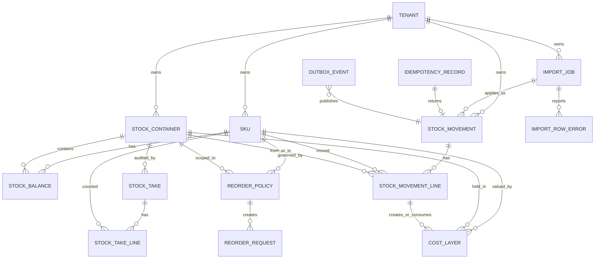

# Stock and Materials Management Design

## 1. Qualifying Questions, Assumptions, and Risks

### Questions I would ask

- Do mobile operatives need to record stock usage while offline, or can the app require connectivity before committing usage?
- Is negative stock ever acceptable operationally, for example when a van count is stale but the work was completed?
- Does procurement already exist in another service, or should this module own purchase orders end to end?
- Are WorkOrder, Location, operative, and vehicle records globally unique across tenants, or do all external identifiers need a tenant/client scope?
- Is valuation required for the first release, or only quantity tracking?
- Do managers need approvals for adjustments, stock takes, transfers, and purchase orders?
- Should vans be modelled as stock containers independent of the operatives assigned to them, or should the current operative assignment control stock access?
- What is the expected retention period for stock movement history and audit data?

### Assumptions

- The first release needs accurate quantity tracking, auditability, and fast stock lookups. Full procurement and advanced valuation can be phased.
- This is a multi-tenant B2B platform. Every table has `tenant_id`; uniqueness is tenant-scoped.
- WorkOrders and Locations remain owned by their existing services. This module stores external references and optionally keeps local read models from SNS events.
- Mobile clients may retry requests. Mutating APIs must be idempotent.
- Operatives normally consume from their assigned van container. Managers can override with appropriate permissions.
- Stock cannot go negative by default. A tenant-level or SKU-level tolerance can allow small negative balances for specific cases, but the default tolerance is zero.
- PostgreSQL is the source of truth. RabbitMQ, Celery, and SNS are used for async processing and integration, not as the authoritative stock history.

### Key risks

- Offline mobile use can create conflicts if multiple devices consume the same van stock before syncing. The MVP should either require online commits or accept pending local drafts that are validated on sync.
- Day-0 data quality is likely poor. Initial quantities should go through validation and reconciliation, not direct database updates.
- If reporting reads from OLTP tables without care, historical reports can degrade operational stock updates.
- If external WorkOrder or Location validation is synchronous on every write, availability of other services can block stock operations.

## 2. Proposed Architecture

I would introduce a dedicated Django/DRF service: `stock-management`.

The service owns:

- Material catalogue entries/SKUs and quantity rules.
- Stock containers such as vans, warehouses, workshops, and future lockers.
- Immutable stock movements and movement lines.
- Current stock balances.
- Stock takes and adjustments.
- Initial stock import jobs.
- Reorder policies and reorder requests.
- Optional cost layers for FIFO/LIFO valuation.

The service does not own:

- WorkOrder lifecycle.
- Location/property lifecycle.
- Operative identity and vehicle assignment source of truth.
- Full supplier/procurement lifecycle if another procurement service exists.

### Service boundaries

`stock-management` stores foreign references to external services:

- `work_order_ref` for usage.
- `location_ref` for site-linked storage containers.
- `operative_ref` and `vehicle_ref` for access and audit.

For user experience and validation, the service may maintain local read models populated from SNS events, for example `known_work_order`, `known_location`, and `vehicle_assignment`. These read models are not transactional ownership boundaries; they are cached facts used for validation and display.

### Core write model

Inventory mutations are modelled as an append-only stock movement ledger:

- Receive stock.
- Consume stock on a work order.
- Transfer stock.
- Adjust stock.
- Apply stocktake discrepancy.
- Load initial stock.
- Return stock, in a later phase.

Each stock-changing request runs inside a PostgreSQL transaction:

1. Validate tenant, permissions, SKU rules, container state, and external references where available.
2. Resolve the affected `stock_balance` rows.
3. Lock those rows with `SELECT ... FOR UPDATE`, in a deterministic order.
4. Check business constraints such as non-negative stock beyond tolerance.
5. Insert immutable `stock_movement` and `stock_movement_line` records.
6. Update `stock_balance` rows as the current projection.
7. Insert an `outbox_event` row.
8. Commit.
9. A Celery worker publishes outbox events to SNS and marks them delivered.

This keeps stock correctness local to one PostgreSQL transaction. It avoids distributed locks and avoids making queue delivery part of the source of truth.

### Failure handling

- If the API request times out after commit, the client can retry with the same `Idempotency-Key` and receive the original response.
- If SNS publishing fails, the committed outbox row is retried asynchronously.
- If a balance projection is suspected to be corrupt, it can be rebuilt from the movement ledger.
- If an import validation fails, no stock state is changed; the import job records row-level errors.

### Design choices for evolution

- Movement types are explicit and extensible.
- Containers use a type field rather than separate tables for van, warehouse, and workshop stock.
- Balances include `reserved` even if reservations are not fully exposed in MVP, or the schema leaves a clear additive migration path.
- Cost layers are separate from quantity balances so valuation can evolve without destabilising stock availability checks.
- Initial stock uses the same ledger path as all other mutations, preserving audit and replay.

## 3. Data Model Package

### ERD



### Tables and field-level descriptions

#### `sku`

Catalogue item for materials.

| Field | Type | Null | Meaning |
| --- | --- | --- | --- |
| `id` | UUID | no | Primary key. |
| `tenant_id` | UUID | no | Tenant/client scope. |
| `code` | varchar(64) | no | Human/business SKU code, unique per tenant. |
| `name` | varchar(255) | no | Display name. |
| `description` | text | yes | Optional details. |
| `unit` | varchar(32) | no | Base unit, for example `each`, `box`, `metre`. |
| `tracking_method` | enum | no | `CONTAINER`, `UNIT`, or `CONTINUOUS`. |
| `min_increment` | numeric(18,6) | no | Smallest valid movement increment. Examples: `1`, `0.1`, `0.01`. |
| `negative_tolerance` | numeric(18,6) | no | How far below zero this SKU may go. Default `0`. |
| `active` | boolean | no | Inactive SKUs cannot be newly received or consumed except during reconciliation. |
| `created_at`, `updated_at` | timestamptz | no | Audit timestamps. |

Constraints and indexes:

- Unique `(tenant_id, code)`.
- Check `min_increment > 0`.
- Check `negative_tolerance >= 0`.
- Check quantities submitted for the SKU are multiples of `min_increment`.
- Index `(tenant_id, active)`.

Important invariant:

- Quantity validation is based on the SKU base unit. API clients may display alternate units, but persisted movements use one canonical unit.

#### `stock_container`

Any place where stock can be held.

| Field | Type | Null | Meaning |
| --- | --- | --- | --- |
| `id` | UUID | no | Primary key. |
| `tenant_id` | UUID | no | Tenant scope. |
| `container_type` | enum | no | `VAN`, `WAREHOUSE`, `WORKSHOP`, later `LOCKER`, `BIN`, etc. |
| `code` | varchar(64) | no | Business identifier, unique per tenant. |
| `name` | varchar(255) | no | Display name. |
| `status` | enum | no | `ACTIVE`, `INACTIVE`, `QUARANTINED`. |
| `location_ref` | varchar(128) | yes | External Location service reference for site-based containers. |
| `vehicle_ref` | varchar(128) | yes | External vehicle reference for van containers. |
| `assigned_operative_refs` | jsonb | yes | Cached operative refs for display and access checks; source of truth remains external. |
| `created_at`, `updated_at` | timestamptz | no | Audit timestamps. |

Constraints and indexes:

- Unique `(tenant_id, code)`.
- Index `(tenant_id, container_type, status)`.
- Partial index on `(tenant_id, vehicle_ref)` where `vehicle_ref is not null`.
- Partial index on `(tenant_id, location_ref)` where `location_ref is not null`.

Important invariants:

- Inactive containers cannot receive normal movements, but can be adjusted for reconciliation.
- A van container should have `vehicle_ref`; a warehouse/workshop normally has `location_ref`.

#### `stock_balance`

Current stock projection for fast reads.

| Field | Type | Null | Meaning |
| --- | --- | --- | --- |
| `id` | UUID | no | Primary key. |
| `tenant_id` | UUID | no | Tenant scope. |
| `container_id` | UUID | no | Stock container. |
| `sku_id` | UUID | no | SKU. |
| `on_hand` | numeric(18,6) | no | Current physical quantity. |
| `reserved` | numeric(18,6) | no | Reserved quantity, default `0`; may be unused in MVP. |
| `version` | bigint | no | Incremented on every update for optimistic read checks/debugging. |
| `last_movement_at` | timestamptz | yes | Timestamp of last applied movement. |
| `updated_at` | timestamptz | no | Projection update time. |

Constraints and indexes:

- Unique `(tenant_id, container_id, sku_id)`.
- Index `(tenant_id, sku_id)` for global stock by SKU.
- Index `(tenant_id, container_id)` for all stock in a container.
- Check `reserved >= 0`.
- Check `on_hand + sku.negative_tolerance >= 0`, enforced in application transaction because it depends on SKU policy.

Important invariants:

- `stock_balance` is not manually edited. It is updated only in the same transaction that writes movement ledger rows.
- `available = on_hand - reserved`.
- The table can be rebuilt from `stock_movement_line`.

#### `stock_movement`

Immutable movement header. This is the authoritative audit trail.

| Field | Type | Null | Meaning |
| --- | --- | --- | --- |
| `id` | UUID | no | Primary key. |
| `tenant_id` | UUID | no | Tenant scope. |
| `movement_type` | enum | no | `USAGE`, `RECEIPT`, `TRANSFER`, `ADJUSTMENT`, `STOCKTAKE`, `INITIAL_LOAD`, `RETURN`. |
| `status` | enum | no | Usually `POSTED`; imports may create `PENDING` then `POSTED` atomically. |
| `external_ref_type` | varchar(64) | yes | Example `WORK_ORDER`, `PURCHASE_ORDER`, `IMPORT_JOB`. |
| `external_ref` | varchar(128) | yes | ID from the owning service or import batch. |
| `reason_code` | varchar(64) | yes | Required for adjustment and stocktake discrepancy. |
| `notes` | text | yes | Operator or manager comments. |
| `idempotency_key` | varchar(255) | yes | Request key for safe retries. |
| `created_by_ref` | varchar(128) | no | User/operative/manager reference. |
| `created_at` | timestamptz | no | Server commit-time timestamp. |
| `posted_at` | timestamptz | no | Business posting timestamp. |

Constraints and indexes:

- Unique `(tenant_id, idempotency_key)` where key is not null.
- Index `(tenant_id, movement_type, posted_at)`.
- Index `(tenant_id, external_ref_type, external_ref)`.
- Partition by month or quarter on `posted_at` once volume justifies it.

Important invariants:

- Posted movements are immutable. Corrections are represented by new adjustment movements.
- Every movement has at least one line.

#### `stock_movement_line`

Line-level quantity deltas.

| Field | Type | Null | Meaning |
| --- | --- | --- | --- |
| `id` | UUID | no | Primary key. |
| `tenant_id` | UUID | no | Tenant scope. |
| `movement_id` | UUID | no | Movement header. |
| `line_no` | integer | no | Stable line ordering. |
| `sku_id` | UUID | no | SKU moved. |
| `container_id` | UUID | no | Container affected by this delta. |
| `quantity_delta` | numeric(18,6) | no | Positive for inbound, negative for outbound. |
| `unit_cost` | numeric(18,6) | yes | Unit cost for receipt or valuation output. |
| `currency` | char(3) | yes | ISO currency for valuation. |
| `metadata` | jsonb | yes | Batch, supplier, serial hints, import row reference, etc. |
| `created_at` | timestamptz | no | Audit timestamp. |

Constraints and indexes:

- Unique `(tenant_id, movement_id, line_no)`.
- Check `quantity_delta <> 0`.
- Index `(tenant_id, container_id, sku_id, created_at)`.
- Index `(tenant_id, sku_id, created_at)`.

Important invariants:

- A transfer is represented as two or more lines under one movement: negative from source, positive to destination.
- Line quantities must conform to `sku.min_increment`.
- The sum of all lines for a `container_id + sku_id` derives the balance.

#### `idempotency_record`

Stores results of mutating API calls.

| Field | Type | Null | Meaning |
| --- | --- | --- | --- |
| `id` | UUID | no | Primary key. |
| `tenant_id` | UUID | no | Tenant scope. |
| `idempotency_key` | varchar(255) | no | Client-generated retry key. |
| `request_hash` | char(64) | no | Hash of normalized request body and endpoint. |
| `status` | enum | no | `IN_PROGRESS`, `SUCCEEDED`, `FAILED`. |
| `response_status` | integer | yes | Original HTTP status. |
| `response_body` | jsonb | yes | Original success/error body. |
| `movement_id` | UUID | yes | Created movement, if any. |
| `expires_at` | timestamptz | no | Retention boundary. |
| `created_at`, `updated_at` | timestamptz | no | Audit timestamps. |

Constraints and indexes:

- Unique `(tenant_id, idempotency_key)`.
- Index `(tenant_id, expires_at)` for cleanup.

Important invariants:

- Reusing the same key with a different request hash returns `409 IdempotencyKeyConflict`.

#### `outbox_event`

Transactional integration event to be published after the stock mutation commits.

| Field | Type | Null | Meaning |
| --- | --- | --- | --- |
| `id` | UUID | no | Primary key. |
| `tenant_id` | UUID | no | Tenant scope. |
| `aggregate_type` | varchar(64) | no | Usually `STOCK_MOVEMENT`. |
| `aggregate_id` | UUID | no | Movement id or related aggregate id. |
| `event_type` | varchar(128) | no | Example `stock.movement.posted`. |
| `payload` | jsonb | no | Event body for SNS consumers. |
| `status` | enum | no | `PENDING`, `PUBLISHED`, `FAILED`. |
| `attempt_count` | integer | no | Publish attempts. |
| `next_attempt_at` | timestamptz | yes | Retry scheduling. |
| `published_at` | timestamptz | yes | Successful publish time. |
| `created_at`, `updated_at` | timestamptz | no | Audit timestamps. |

Constraints and indexes:

- Index `(status, next_attempt_at)` for publisher workers.
- Index `(tenant_id, aggregate_type, aggregate_id)`.

Important invariants:

- Outbox rows are inserted in the same transaction as the stock movement.
- Consumers must handle duplicate events; at-least-once delivery is assumed.

#### `stock_take` and `stock_take_line`

Audit session and counted quantities.

`stock_take` fields:

| Field | Type | Null | Meaning |
| --- | --- | --- | --- |
| `id` | UUID | no | Primary key. |
| `tenant_id` | UUID | no | Tenant scope. |
| `container_id` | UUID | no | Container being counted. |
| `status` | enum | no | `DRAFT`, `COUNTED`, `POSTED`, `CANCELLED`. |
| `started_by_ref` | varchar(128) | no | User who started the count. |
| `posted_movement_id` | UUID | yes | Adjustment movement created when posted. |
| `started_at`, `posted_at` | timestamptz | yes/no by status | Audit timestamps. |

`stock_take_line` fields:

| Field | Type | Null | Meaning |
| --- | --- | --- | --- |
| `id` | UUID | no | Primary key. |
| `stock_take_id` | UUID | no | Parent stock take. |
| `sku_id` | UUID | no | Counted SKU. |
| `expected_quantity` | numeric(18,6) | no | Balance when line was prepared or counted. |
| `counted_quantity` | numeric(18,6) | no | Physical count. |
| `discrepancy_quantity` | numeric(18,6) | no | `counted - expected`. |
| `reason_code` | varchar(64) | yes | Required for material discrepancies. |
| `notes` | text | yes | Count notes. |

Constraints and indexes:

- Unique active stock take per `(tenant_id, container_id)` where status in `DRAFT`, `COUNTED`.
- Unique `(stock_take_id, sku_id)`.
- Index `(tenant_id, container_id, status)`.

Important invariants:

- Posting a stock take creates a `STOCKTAKE` movement for non-zero discrepancies.
- If balances changed since expected quantities were captured, posting either recalculates discrepancy under lock or returns `409 StockTakeStale`.

#### `import_job` and `import_row_error`

Day-0 catalogue and initial stock import flow.

`import_job` fields:

| Field | Type | Null | Meaning |
| --- | --- | --- | --- |
| `id` | UUID | no | Primary key. |
| `tenant_id` | UUID | no | Tenant scope. |
| `import_type` | enum | no | `CATALOGUE`, `INITIAL_STOCK`, `CATALOGUE_AND_STOCK`. |
| `status` | enum | no | `UPLOADED`, `VALIDATING`, `VALIDATED`, `FAILED_VALIDATION`, `APPROVED`, `APPLYING`, `APPLIED`, `FAILED_APPLY`. |
| `source_uri` | text | yes | S3/object storage URI for uploaded CSV. |
| `dry_run` | boolean | no | Whether validation is preview-only. |
| `summary` | jsonb | yes | Counts, totals, warnings. |
| `approved_by_ref` | varchar(128) | yes | Manager approval. |
| `applied_movement_id` | UUID | yes | Initial load movement, if applied as one batch. |
| `created_at`, `updated_at`, `applied_at` | timestamptz | mixed | Lifecycle timestamps. |

`import_row_error` fields:

| Field | Type | Null | Meaning |
| --- | --- | --- | --- |
| `id` | UUID | no | Primary key. |
| `import_job_id` | UUID | no | Parent import job. |
| `row_number` | integer | no | CSV/API row number. |
| `severity` | enum | no | `ERROR` or `WARNING`. |
| `field_name` | varchar(128) | yes | Field in error. |
| `message` | text | no | Human-readable error. |
| `raw_row` | jsonb | yes | Original row for diagnostics. |

Constraints and indexes:

- Index `(tenant_id, status, created_at)` on import jobs.
- Index `(import_job_id, severity)`.
- Optional tenant guard to prevent multiple `INITIAL_STOCK` imports unless explicitly marked as a correction.

Important invariants:

- Initial quantities are applied as `INITIAL_LOAD` movements, not direct balance edits.
- Imports should support dry-run, approval, and reconciliation reports.

#### `reorder_policy` and `reorder_request`

Low-stock alerting and lightweight reorder support.

`reorder_policy` fields:

| Field | Type | Null | Meaning |
| --- | --- | --- | --- |
| `id` | UUID | no | Primary key. |
| `tenant_id` | UUID | no | Tenant scope. |
| `sku_id` | UUID | no | SKU. |
| `container_id` | UUID | yes | Optional container-specific policy. Null means global/default policy. |
| `min_quantity` | numeric(18,6) | no | Alert threshold. |
| `target_quantity` | numeric(18,6) | no | Desired replenishment level. |
| `active` | boolean | no | Policy status. |
| `created_at`, `updated_at` | timestamptz | no | Audit timestamps. |

`reorder_request` fields:

| Field | Type | Null | Meaning |
| --- | --- | --- | --- |
| `id` | UUID | no | Primary key. |
| `tenant_id` | UUID | no | Tenant scope. |
| `policy_id` | UUID | yes | Triggering policy. |
| `sku_id` | UUID | no | SKU requested. |
| `container_id` | UUID | yes | Container to replenish, if applicable. |
| `requested_quantity` | numeric(18,6) | no | Suggested reorder amount. |
| `status` | enum | no | `OPEN`, `APPROVED`, `ORDERED`, `CANCELLED`, `FULFILLED`. |
| `created_by` | enum | no | `SYSTEM` or `USER`. |
| `external_purchase_order_ref` | varchar(128) | yes | Link to procurement service. |
| `created_at`, `updated_at` | timestamptz | no | Audit timestamps. |

Constraints and indexes:

- Unique active policy for `(tenant_id, sku_id, container_id)`.
- Index `(tenant_id, status, created_at)` on reorder requests.

Important invariants:

- Reorder requests do not change stock. Only receipts change stock.

#### `cost_layer` (stretch)

Supports FIFO/LIFO valuation without making quantity availability depend on valuation.

| Field | Type | Null | Meaning |
| --- | --- | --- | --- |
| `id` | UUID | no | Primary key. |
| `tenant_id` | UUID | no | Tenant scope. |
| `sku_id` | UUID | no | SKU. |
| `container_id` | UUID | no | Container holding the layer. |
| `source_movement_line_id` | UUID | no | Receipt or initial load line that created the layer. |
| `received_quantity` | numeric(18,6) | no | Original layer quantity. |
| `remaining_quantity` | numeric(18,6) | no | Quantity still unconsumed. |
| `unit_cost` | numeric(18,6) | no | Cost per base unit. |
| `currency` | char(3) | no | ISO currency. |
| `received_at` | timestamptz | no | Ordering timestamp for FIFO/LIFO. |

Constraints and indexes:

- Index `(tenant_id, sku_id, container_id, received_at)`.
- Check `remaining_quantity >= 0`.
- Cost consumption should run in the same transaction as stock consumption if valuation is enabled.

### Ledger-only vs persisted balances vs snapshots

Ledger-only is the cleanest audit model because every current and historical quantity is derived from movements. However, every stock lookup becomes an aggregation over potentially large history. That is a poor fit for mobile UX and frequent manager dashboards.

Persisted balances are fast for current stock and straightforward to lock for concurrent writes. The trade-off is that they are a projection and can drift if code updates balances outside the movement transaction. The mitigation is a strict invariant: all mutations go through the ledger path, balances are updated transactionally, and reconciliation jobs compare balances against ledger aggregates.

Materialized views or snapshots are useful for historical reporting and `stock at time T`. They should not replace the write model. I would use periodic daily snapshots plus movement deltas after the snapshot for historical queries. Heavy reporting should run against replicas or analytical storage, not directly against hot OLTP tables.

The pragmatic design is hybrid:

- `stock_movement` and `stock_movement_line` are the source of truth.
- `stock_balance` is the current-state projection used by APIs.
- Snapshots/materialized views serve historical and analytical read paths.

## 4. API Design

All mutating endpoints require:

- `Authorization` with tenant/user context.
- `Idempotency-Key` header.
- Server-side permission checks.
- Request body validation against SKU units, increments, container state, and business rules.

Common error semantics:

- `400 Bad Request`: malformed request, invalid quantity, invalid unit, missing required reason.
- `401/403`: unauthenticated or unauthorized.
- `404 Not Found`: unknown SKU/container, or unknown external reference when strict validation is enabled.
- `409 Conflict`: insufficient stock, stale stocktake, duplicate idempotency key with different body, inactive container conflict.
- `422 Unprocessable Entity`: import parsed successfully but contains validation errors.
- `202 Accepted`: async job accepted.

### Record usage on a work order

`POST /stock-usages`

Request:

```json
{
  "work_order_ref": "WO-12345",
  "container_id": "0ff8655e-8e53-4094-8e8f-b474d1f2d09e",
  "operative_ref": "USER-100",
  "occurred_at": "2026-05-28T09:30:00Z",
  "lines": [
    {
      "sku_id": "35228322-5360-4386-bbd3-c8e0c269c447",
      "quantity": "3",
      "unit": "each"
    },
    {
      "sku_id": "b15ad34d-788d-46fd-a28e-71ab1c1e859d",
      "quantity": "2.4",
      "unit": "metre"
    }
  ]
}
```

Response `201`:

```json
{
  "movement_id": "09dd1b56-e88f-43a6-ac71-ecff2f976dc2",
  "type": "USAGE",
  "status": "POSTED",
  "balances": [
    {
      "container_id": "0ff8655e-8e53-4094-8e8f-b474d1f2d09e",
      "sku_id": "35228322-5360-4386-bbd3-c8e0c269c447",
      "on_hand": "17",
      "reserved": "0",
      "available": "17"
    }
  ]
}
```

Validation:

- Work order exists or is accepted as a syntactically valid external ref depending on integration mode.
- Operative is allowed to consume from the container.
- Quantities are positive in request and converted to negative deltas internally.
- Each quantity is a multiple of `sku.min_increment`.
- Post-commit balance must not be below `-negative_tolerance`.

Conflict example:

```json
{
  "code": "INSUFFICIENT_STOCK",
  "message": "Requested quantity would reduce stock below tolerance.",
  "details": {
    "sku_id": "35228322-5360-4386-bbd3-c8e0c269c447",
    "container_id": "0ff8655e-8e53-4094-8e8f-b474d1f2d09e",
    "available": "2",
    "requested": "3"
  }
}
```

### Receive stock

`POST /stock-receipts`

Request:

```json
{
  "destination_container_id": "5d0d19b7-dc55-4054-8b3d-455141cceca6",
  "purchase_order_ref": "PO-9001",
  "supplier_ref": "SUP-77",
  "received_at": "2026-05-28T10:15:00Z",
  "lines": [
    {
      "sku_id": "35228322-5360-4386-bbd3-c8e0c269c447",
      "quantity": "100",
      "unit": "each",
      "unit_cost": "0.04",
      "currency": "GBP"
    }
  ]
}
```

Response `201` returns the receipt movement and updated balances.

Validation:

- Destination container is active.
- Received quantities are positive and valid increments.
- Cost fields are required only if valuation is enabled for the tenant.

### Transfer stock

`POST /stock-transfers`

Request:

```json
{
  "source_container_id": "5d0d19b7-dc55-4054-8b3d-455141cceca6",
  "destination_container_id": "0ff8655e-8e53-4094-8e8f-b474d1f2d09e",
  "reason_code": "VAN_REPLENISHMENT",
  "lines": [
    {
      "sku_id": "35228322-5360-4386-bbd3-c8e0c269c447",
      "quantity": "25",
      "unit": "each"
    }
  ]
}
```

Response `201` returns a single transfer movement with negative source lines and positive destination lines.

Validation:

- Source and destination differ.
- Both containers are active.
- Source has sufficient available stock.
- Lock source and destination balance rows in deterministic `(container_id, sku_id)` order to reduce deadlock risk.

### Adjust stock

`POST /stock-adjustments`

Request:

```json
{
  "container_id": "0ff8655e-8e53-4094-8e8f-b474d1f2d09e",
  "reason_code": "DAMAGED",
  "notes": "Cable roll damaged during loading.",
  "lines": [
    {
      "sku_id": "b15ad34d-788d-46fd-a28e-71ab1c1e859d",
      "quantity_delta": "-1.5",
      "unit": "metre"
    }
  ]
}
```

Validation:

- Manager permission required.
- Reason is mandatory.
- Negative adjustments must respect tolerance unless an elevated override permission is used.

### Query stock levels

`GET /stock-levels?sku_id={sku_id}`

Returns stock across all containers for a SKU, including totals.

`GET /containers/{container_id}/stock-levels`

Returns current stock in one container.

`GET /containers/{container_id}/stock-levels/history?at=2026-05-28T09:00:00Z`

Returns stock as of a point in time. Implementation can use nearest snapshot before `at` plus movement deltas after the snapshot.

Example response:

```json
{
  "container_id": "0ff8655e-8e53-4094-8e8f-b474d1f2d09e",
  "as_of": "2026-05-28T11:00:00Z",
  "items": [
    {
      "sku_id": "35228322-5360-4386-bbd3-c8e0c269c447",
      "code": "SCREW-001",
      "name": "Wood screw",
      "unit": "each",
      "on_hand": "17",
      "reserved": "0",
      "available": "17"
    }
  ]
}
```

### Stock take

`POST /stock-takes`

Creates a draft count for a container.

`POST /stock-takes/{id}/lines`

Adds or replaces counted lines.

`POST /stock-takes/{id}/post`

Posts discrepancies as a `STOCKTAKE` movement.

Posting response includes the discrepancy movement and updated balances. If stock changed since the count snapshot, the API returns `409 StockTakeStale` with current expected quantities so the client can review.

### Day-0 import and initialization

`POST /imports/initial-stock`

Accepts a CSV upload reference or JSON payload and starts async validation.

Request:

```json
{
  "source_uri": "s3://client-imports/acme/initial-stock.csv",
  "dry_run": true
}
```

Response `202`:

```json
{
  "import_job_id": "a3c74939-5598-4867-a00b-07086a1e5908",
  "status": "VALIDATING"
}
```

`GET /imports/{id}` returns status, summary, warnings, and errors.

`POST /imports/{id}/approve`

Requires manager/admin permission. Moves a validated import to `APPROVED`.

`POST /imports/{id}/apply`

Applies catalogue/container rows as needed and creates `INITIAL_LOAD` stock movements for quantities and optional cost layers.

Day-0 import validation:

- SKU codes must be unique per tenant.
- Units and tracking methods must be valid.
- Containers must exist or be declared in the import.
- Quantities must satisfy minimum increments.
- Initial quantities cannot be negative unless explicitly marked as a corrective import.
- Optional cost layers must sum to the initial quantity for a SKU/container when valuation is enabled.

## 5. Migration and Rollout Plan

### Schema migration approach

- Create new tables in the `stock-management` service without changing existing WorkOrder or Location schemas.
- Use additive migrations: create tables, indexes concurrently where needed, then enable writes through feature flags.
- Avoid destructive migrations during rollout. Keep old columns/tables until unused and verified.
- Introduce enums in a way that supports future values, or use constrained varchar with application-level validation if PostgreSQL enum migrations are operationally painful.
- Build partitioning only when needed, but design movement tables with `posted_at` and tenant indexes that allow future partitioning.

### Backfills and initial setup

- Backfill container records from known warehouses/sites and vehicles, or import them during day-0 setup.
- Subscribe to WorkOrder, Location, vehicle, and operative assignment SNS events to build local validation/display read models.
- Import catalogue and initial stock through the import workflow.
- Generate reconciliation reports comparing imported totals against client-provided sign-off totals.

### Rollout plan

1. Deploy schema and read-only catalogue/container admin behind feature flags.
2. Enable day-0 import dry runs for internal users.
3. Enable stock receipts and current stock views for a pilot tenant.
4. Enable van transfers and manager adjustments.
5. Enable work order usage for a small operative group, requiring online commits initially.
6. Monitor invariants, latency, conflict rates, and support tickets.
7. Expand tenant by tenant and enable reorder policies after stock data quality is stable.

### Monitoring during rollout

- Count movement writes by type.
- Track stock write latency and row lock wait time.
- Track insufficient stock conflicts.
- Alert on negative balances below tolerance.
- Alert if outbox events are not published within a defined SLA.
- Run scheduled reconciliation between ledger aggregates and balances.

## 6. Non-Functional Considerations

### Concurrency control

PostgreSQL row-level locking on `stock_balance` is the main concurrency mechanism.

For each stock mutation:

- Start a transaction.
- Upsert missing balance rows with zero quantity where appropriate.
- Lock all affected balance rows using `SELECT ... FOR UPDATE`.
- Lock rows in deterministic order to reduce deadlocks.
- Validate stock availability while holding locks.
- Write movement rows and update balances.
- Commit quickly.

The expected scale, hundreds of concurrent users and thousands of movements per day, is well within this model if transactions are small and indexes are correct.

Use optimistic version fields for read clients that want to detect stale stock views, but do not rely on optimistic checks alone for stock decrement correctness.

### Scalability

- Current stock reads hit `stock_balance`, not the ledger.
- Common indexes support `(tenant_id, container_id)` and `(tenant_id, sku_id)` lookup paths.
- Movement history can be partitioned by `posted_at` when volume grows.
- Historical reports use read replicas, snapshots, or analytical exports.
- Reorder checks can be async: a balance update emits an event, and a worker evaluates policies.
- Avoid large synchronous imports; validate and apply them in Celery jobs with progress tracking.

### Reliability

- Mutating requests are idempotent using `Idempotency-Key`.
- The outbox pattern guarantees movement commits and integration events cannot diverge permanently.
- Queue consumers must be idempotent because SNS/RabbitMQ delivery can duplicate.
- External service outages should not corrupt stock. If WorkOrder validation is unavailable, the service can either reject with retryable `503` or accept the external ref under a tenant-configured degraded mode and reconcile later.
- Posted movements are immutable; corrections are new movements.

### Observability

Metrics:

- `stock_movement_created_total{type}`.
- `stock_mutation_latency_ms`.
- `stock_balance_lock_wait_ms`.
- `stock_conflict_total{reason}`.
- `negative_balance_total`.
- `outbox_publish_lag_seconds`.
- `import_validation_errors_total`.
- `ledger_balance_mismatch_total`.

Logs:

- Include tenant, movement id, idempotency key, external ref, container ids, and SKU ids.
- Do not log sensitive user or supplier details unnecessarily.

Alerts:

- Any balance below configured tolerance.
- Ledger/balance reconciliation mismatch.
- Outbox backlog above SLA.
- Import apply failures.
- Elevated `409 INSUFFICIENT_STOCK` rate after rollout.

### Security and permissions

- Operatives can record usage only against allowed work orders and assigned containers.
- Managers can transfer, adjust, and stocktake within their operational scope.
- Admin/import permissions are separate from day-to-day stock management.
- All APIs are tenant-scoped; never trust client-supplied tenant ids without auth context.

## 7. MVP to v2 Phase Plan

### MVP

- SKU catalogue with unit and increment rules.
- Stock containers for vans and storage sites.
- Immutable movement ledger.
- Transactional current balances.
- Work order usage.
- Receipts.
- Transfers.
- Manager adjustments.
- Current stock queries.
- Day-0 import with dry-run validation and approval.
- Basic stock take with discrepancy posting.
- Outbox events and core observability.

### v2

- Reservations and allocations against planned work.
- Returns from work orders back to vans or warehouses.
- Reorder policies and reorder requests.
- Richer mobile offline workflow with conflict resolution.
- FIFO/LIFO cost valuation and cost reports.
- Bin-level warehouse structure.
- Approval workflows for adjustments and high-value transfers.
- Reporting snapshots and analytical exports.

### Deferred but enabled by the design

- Full purchase order lifecycle can live in a procurement service while receipts remain in stock management.
- Additional container types are additive values and metadata, not new inventory models.
- Valuation layers can be added without changing the core quantity ledger.
- Historical reporting can move to snapshots or a warehouse without changing write semantics.
