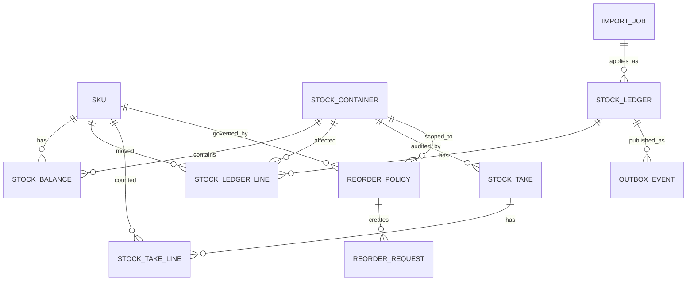

# Stock and Materials Management Design

## 1. Questions, Assumptions, and Scope

### Questions I would ask

- Do operatives need to record usage offline, or can stock commits require connectivity?
- Can stock ever go negative operationally, for example because a van count is stale?
- Does procurement already exist elsewhere, or should this module own purchase orders?
- Are WorkOrder, Location, vehicle, and user identifiers globally unique across services?
- Is FIFO/LIFO cost valuation needed in MVP, or only later?
- Do stock adjustments, transfers, and stock takes require approval workflows?

### Assumptions

- The MVP focuses on accurate quantity tracking, auditability, and fast stock lookup.
- WorkOrders and Locations are owned by existing services. This module stores external references and may keep local read-model stubs for display/validation.
- Stock is held in containers: vans, warehouses, workshops, and future container types such as lockers.
- Main user roles are Field Operative, Operations Manager, Store Manager, and General Manager/Admin.
- PostgreSQL is the source of truth. RabbitMQ/Celery/SNS are delivery mechanisms, not the authoritative inventory history.
- Stock cannot go negative by default. A SKU-level or system-level tolerance can allow controlled exceptions.

### Main risks

- Offline mobile usage can create conflicts when multiple devices consume the same van stock before syncing.
- Initial customer data may be incomplete or inaccurate, so day-0 import needs validation and reconciliation.
- Reporting over the raw ledger can become expensive unless current balances and snapshots are used.
- Synchronous validation against WorkOrder/Location services can reduce availability if those services are down.

## 2. Proposed Architecture

I would introduce a dedicated Django/DRF service called `stock-management`.

It owns:

- Material catalogue/SKUs and quantity rules.
- Stock containers: vans, warehouses, workshops, later lockers/bins, plus virtual accounting containers.
- Immutable stock ledger entries.
- Current stock balances.
- Stock takes, adjustments, transfers, receipts, usage, and day-0 imports.
- Reorder policies and lightweight reorder requests.
- Optional cost layers for FIFO/LIFO valuation.

It does not own:

- WorkOrder lifecycle.
- Location/property lifecycle.
- User/operative identity.
- Vehicle assignment source of truth.
- Full procurement lifecycle, if that already exists elsewhere.

External concepts are represented as references:

- `work_order_ref` for usage.
- `location_ref` for storage sites.
- `vehicle_ref` for van containers.
- `operative_ref` / `user_ref` for audit and access control.

The service may maintain local stubs such as `known_work_order`, `known_location`, or `vehicle_assignment` from SNS events. These are read models, not ownership boundaries.

## 3. Core Design

Inventory mutations are stored in an append-only `StockLedger` using double-entry inventory accounting.

Every stock-changing action creates ledger records:

- `RECEIPT`: goods received into a container.
- `USAGE`: materials consumed on a work order.
- `TRANSFER`: stock moved between containers.
- `ADJUSTMENT`: manual correction with a reason.
- `STOCKTAKE`: discrepancy correction from an audit.
- `INITIAL_LOAD`: day-0 starting stock.
- `RETURN`: future return from a job.

Current physical stock is stored separately in `stock_balance` for fast reads. This is a projection of the ledger for real containers only, not a separate source of truth.

Important invariant:

> `stock_balance` for real containers must always be derivable from `stock_ledger_line`, and every posted ledger transaction must balance to zero per SKU/unit across real and virtual containers.

### Real vs virtual stock

Real stock means physical inventory that can be counted, transferred, reserved, or used by operatives. It exists only in real containers such as vans, warehouses, workshops, lockers, and bins.

Virtual stock is not available inventory. It is an accounting representation used only inside the ledger to make each transaction balanced and explain where stock came from or went. 

Virtual containers should never be assignable to operatives, selected as transfer destinations in normal UI, or included in operational on-hand totals.

Virtual containers include:

- `SUPPLIER_SOURCE`: balances receipts into stock.
- `WORK_ORDER_CONSUMED`: sink for materials consumed on work orders.
- `ADJUSTMENT_GAIN`: source for found stock or positive corrections.
- `ADJUSTMENT_LOSS`: sink for damaged, lost, or written-off stock.
- `INITIAL_LOAD_SOURCE`: balances day-0 starting stock.
- `RETURNED_FROM_WORK_ORDER`: source for future returns.

Operational stock views include only real containers. Audit and reporting views may include both real and virtual containers.

### Write path

```text
API request
  -> open PostgreSQL transaction
  -> validate user role, SKU rules, containers, and external refs where available
  -> create or find affected stock_balance rows for real containers
  -> lock affected rows with SELECT ... FOR UPDATE
  -> check no balance falls below allowed tolerance
  -> insert stock_ledger + stock_ledger_line rows
  -> validate ledger lines balance to zero per SKU/unit
  -> update stock_balance projection
  -> insert outbox_event
  -> commit
  -> async worker publishes event to SNS/RabbitMQ
```

This uses PostgreSQL transactions for atomicity and row locks for concurrency. The ledger provides auditability, replay, stock-at-time queries, and recovery if a projection becomes corrupt.

Queue events are not the durable source of truth. They notify other services that a committed stock movement happened.

```text
stock_ledger          = permanent source of truth, including real and virtual postings
stock_balance         = current physical stock projection for real containers only
virtual ledger lines  = accounting explanation, not available stock
queue event           = integration/delivery mechanism
```

## 4. Data Model

### ERD



### `sku`

Material catalogue item.

| Field | Type | Null | Meaning |
| --- | --- | --- | --- |
| `id` | UUID | no | Primary key. |
| `code` | varchar | no | Business SKU code. |
| `name` | varchar | no | Display name. |
| `unit` | varchar | no | Canonical unit: `each`, `box`, `metre`, etc. |
| `tracking_method` | enum | no | `CONTAINER`, `UNIT`, or `CONTINUOUS`. |
| `min_increment` | numeric | no | Smallest valid movement, e.g. `1`, `0.1`, `0.01`. |
| `negative_tolerance` | numeric | no | Allowed negative threshold; default `0`. |
| `active` | boolean | no | Inactive SKUs cannot be used for normal new movements. |

Key constraints and indexes:

- Unique `code`.
- `min_increment > 0`.
- `negative_tolerance >= 0`.
- Index `active`.

Invariants:

- Persist quantities in the SKU canonical unit.
- Movement quantities must be multiples of `min_increment`.

### `stock_container`

Any real or virtual place where stock is posted. Real containers represent physical stock locations.

Virtual containers represent accounting sources and sinks and do not hold operational stock.

| Field | Type | Null | Meaning |
| --- | --- | --- | --- |
| `id` | UUID | no | Primary key. |
| `container_type` | enum | no | `VAN`, `WAREHOUSE`, `WORKSHOP`, later `LOCKER`, `BIN`, plus virtual types such as `SUPPLIER_SOURCE` and `WORK_ORDER_CONSUMED`. |
| `is_virtual` | boolean | no | Whether this is an accounting container rather than a physical stock location. |
| `code` | varchar | no | Business identifier. |
| `name` | varchar | no | Display name. |
| `status` | enum | no | `ACTIVE`, `INACTIVE`, `QUARANTINED`. |
| `location_ref` | varchar | yes | External Location service ID for site-based storage. |
| `vehicle_ref` | varchar | yes | External vehicle ID for van containers. |

Key constraints and indexes:

- Unique `code`.
- Index `(is_virtual, container_type, status)`.
- Partial index on `vehicle_ref` where present.
- Partial index on `location_ref` where present.

Invariants:

- Van containers normally have a `vehicle_ref`.
- Warehouse/workshop containers normally have a `location_ref`.
- Inactive real containers cannot receive normal operational movements.
- Virtual containers are not shown in normal "stock on hand" operational views and cannot be used for reservations, van assignment, or manual transfers.

### `stock_balance`

Fast current physical stock projection for real containers only. 
There are no `stock_balance` rows for virtual containers.

| Field | Type | Null | Meaning |
| --- | --- | --- | --- |
| `id` | UUID | no | Primary key. |
| `container_id` | UUID | no | Stock container. |
| `sku_id` | UUID | no | Material item. |
| `on_hand` | numeric | no | Current physical quantity. |
| `reserved` | numeric | no | Reserved quantity, default `0`; may be unused in MVP. |
| `version` | bigint | no | Incremented on update. |
| `updated_at` | timestamptz | no | Projection update time. |

Key constraints and indexes:

- Unique `(container_id, sku_id)`.
- Index `container_id` for container stock.
- Index `sku_id` for global stock by SKU.
- `reserved >= 0`.
- `container_id` must reference a real, non-virtual container.

Invariants:

- Updated only by the stock mutation transaction.
- `available = on_hand - reserved`.
- Rebuildable from ledger lines where `container.is_virtual = false`.
- Represents operational on-hand stock only; virtual ledger quantities are excluded.

### `stock_ledger`

Immutable movement header.

| Field | Type | Null | Meaning |
| --- | --- | --- | --- |
| `id` | UUID | no | Primary key. |
| `movement_type` | enum | no | `USAGE`, `RECEIPT`, `TRANSFER`, `ADJUSTMENT`, `STOCKTAKE`, `INITIAL_LOAD`, `RETURN`. |
| `external_ref_type` | varchar | yes | `WORK_ORDER`, `PURCHASE_ORDER`, `IMPORT_JOB`, etc. |
| `external_ref` | varchar | yes | External ID. |
| `reason_code` | varchar | yes | Required for adjustments and discrepancy corrections. |
| `idempotency_key` | varchar | yes | API retry key. |
| `created_by_ref` | varchar | no | User/operative/manager reference. |
| `posted_at` | timestamptz | no | Business posting time. |

Key constraints and indexes:

- Unique `idempotency_key` where present.
- Index `(movement_type, posted_at)`.
- Index `(external_ref_type, external_ref)`.
- Future partitioning by `posted_at` if volume requires it.

Invariants:

- Posted ledger records are immutable.
- Corrections are represented by new adjustment movements.
- Every ledger entry has at least two lines.
- Posted ledger entries must balance to zero per SKU/unit across their lines.

### `stock_ledger_line`

Line-level quantity delta.

| Field | Type | Null | Meaning |
| --- | --- | --- | --- |
| `id` | UUID | no | Primary key. |
| `ledger_id` | UUID | no | Parent movement. |
| `line_no` | integer | no | Stable order within movement. |
| `sku_id` | UUID | no | Material item. |
| `container_id` | UUID | no | Container affected. |
| `quantity_delta` | numeric | no | Positive inbound, negative outbound. |
| `unit_cost` | numeric | yes | Optional valuation data. |
| `posted_at` | timestamptz | no | Copied from the ledger header for efficient historical queries. |
| `metadata` | jsonb | yes | Batch, import row, supplier, notes. |

Key constraints and indexes:

- Unique `(ledger_id, line_no)`.
- `quantity_delta <> 0`.
- Index `(container_id, sku_id, posted_at)`.
- Index `(sku_id, posted_at)`.

Invariants:

- Usage creates negative lines.
- Receipt creates positive lines.
- Transfer creates one negative source line and one positive destination line under the same ledger entry.
- For double-entry consistency, every movement also has a balancing line. 
- Receipts balance against `SUPPLIER_SOURCE`, usage balances against `WORK_ORDER_CONSUMED`, adjustments balance against `ADJUSTMENT_GAIN` or `ADJUSTMENT_LOSS`, and initial loads balance against `INITIAL_LOAD_SOURCE`.

### Supporting tables

| Table | Purpose |
| --- | --- |
| `idempotency_record` | Stores request hash, status, and response for safe mobile/API retries. |
| `outbox_event` | Stores committed integration events to publish asynchronously. |
| `stock_take` | Stock audit session for one container. |
| `stock_take_line` | Counted quantity, expected quantity, and discrepancy by SKU. |
| `import_job` | Day-0 catalogue and stock import lifecycle. |
| `import_row_error` | Row-level validation errors and warnings. |
| `reorder_policy` | Min/target quantity rules. |
| `reorder_request` | Lightweight request to replenish stock. |
| `cost_layer` | Optional FIFO/LIFO valuation layer. |

### Ledger vs balances vs snapshots

Ledger-only is best for auditability, especially with double-entry balancing, but too slow for frequent mobile and dashboard reads because every lookup aggregates history.

Persisted balances are fast and easy to lock for concurrent writes, but they are a projection of physical stock only. They must only be updated transactionally with ledger inserts for real containers.

Snapshots/materialized views are useful for historical reports and `stock at time T`. They should not replace the write model. A practical approach is daily snapshots plus ledger deltas after the snapshot.

Recommended model:

- Ledger is the balanced source of truth for real and virtual postings.
- Balance is the current physical stock projection for real containers.
- Snapshots/read replicas support reporting.

## 5. API Design

All mutating endpoints require authorization, permission checks, and an `Idempotency-Key` header.

### Record usage on a work order

`POST /stock-usages`

```json
{
  "work_order_ref": "WO-12345",
  "container_id": "van-1",
  "operative_ref": "user-100",
  "lines": [
    { "sku_id": "screw-001", "quantity": "3", "unit": "each" },
    { "sku_id": "cable-001", "quantity": "2.4", "unit": "metre" }
  ]
}
```

Rules:

- Field Operative can consume only from an assigned van unless a manager overrides.
- WorkOrder is validated against a local stub or external service, depending on availability strategy.
- Quantities must be positive and valid for the SKU increment.
- The requested `container_id` must be a real container.
- Internally, usage writes a negative line from the van and a positive balancing line to `WORK_ORDER_CONSUMED`, tagged with the work order reference.
- If stock would fall below tolerance, return `409 INSUFFICIENT_STOCK`.

### Receive stock

`POST /stock-receipts`

```json
{
  "destination_container_id": "warehouse-1",
  "purchase_order_ref": "PO-9001",
  "lines": [
    { "sku_id": "screw-001", "quantity": "100", "unit": "each", "unit_cost": "0.04" }
  ]
}
```

Rules:

- Store Manager permission required.
- Destination container must be active.
- Destination container must be real.
- Quantities are positive.
- Internally, receipt writes a positive destination line and a negative balancing line from `SUPPLIER_SOURCE`.
- Optional valuation data creates cost layers if enabled.

### Transfer stock

`POST /stock-transfers`

```json
{
  "source_container_id": "warehouse-1",
  "destination_container_id": "van-1",
  "reason_code": "VAN_REPLENISHMENT",
  "lines": [
    { "sku_id": "screw-001", "quantity": "25", "unit": "each" }
  ]
}
```

Rules:

- Operations Manager or Store Manager permission required.
- Source and destination must be different real containers.
- Source and destination balance rows are locked in deterministic order to reduce deadlocks.
- One ledger entry contains both source negative lines and destination positive lines. Since both sides are real containers, the transaction balances without a virtual container.

### Adjust stock

`POST /stock-adjustments`

```json
{
  "container_id": "van-1",
  "reason_code": "DAMAGED",
  "notes": "Cable roll damaged during loading.",
  "lines": [
    { "sku_id": "cable-001", "quantity_delta": "-1.5", "unit": "metre" }
  ]
}
```

Rules:

- Manager permission required.
- Reason is mandatory.
- The requested `container_id` must be a real container.
- Negative adjustments respect tolerance unless an elevated override is explicitly allowed.
- Internally, negative adjustments balance against `ADJUSTMENT_LOSS`; positive adjustments balance against `ADJUSTMENT_GAIN`.

### Stock queries

```text
GET /stock-levels?sku_id=screw-001
GET /containers/{container_id}/stock-levels
GET /containers/{container_id}/stock-levels/history?at=2026-05-28T09:00:00Z
```

Current operational reads use `stock_balance` and return only real-container on-hand stock. Historical operational reads also exclude virtual containers unless an explicit audit/reporting endpoint requests full ledger postings. Historical reads use snapshots plus ledger deltas, or direct ledger aggregation for small ranges.

### Stock take

```text
POST /stock-takes
POST /stock-takes/{id}/lines
POST /stock-takes/{id}/post
```

Posting a stock take creates a `STOCKTAKE` ledger entry for discrepancies. Positive discrepancies balance against `ADJUSTMENT_GAIN`; negative discrepancies balance against `ADJUSTMENT_LOSS`. If balances changed since the count was prepared, return `409 STOCK_TAKE_STALE` with current expected quantities.

### Day-0 import

```text
POST /imports/initial-stock
GET  /imports/{id}
POST /imports/{id}/approve
POST /imports/{id}/apply
```

The import flow supports CSV or API payloads for:

- Initial catalogue items.
- Containers and storage locations.
- Initial stock quantities per container.
- Optional initial cost layers.

The apply step creates `INITIAL_LOAD` ledger entries balanced against `INITIAL_LOAD_SOURCE`. It does not directly edit balances.

### Error semantics

| Status | Meaning |
| --- | --- |
| `400` | Invalid body, unit, quantity, increment, or missing reason. |
| `401/403` | Authentication or permission failure. |
| `404` | Unknown SKU/container/external reference when strict validation is enabled. |
| `409` | Business conflict: insufficient stock, stale stocktake, idempotency conflict. |
| `422` | Import parsed but contains validation errors. |
| `202` | Async import accepted. |

## 6. Day-0 Population

Day-0 population is mandatory because customers already have stock in vans and sites.

Recommended process:

1. Upload catalogue, containers, quantities, and optional cost layers by CSV/API.
2. Validate asynchronously and produce a dry-run report.
3. Show row-level errors and warnings.
4. Require manager/admin approval.
5. Apply the import as `INITIAL_LOAD` ledger entries.
6. Produce a reconciliation report with totals by SKU and container.
7. Prevent accidental duplicate initial loads unless explicitly marked as correction imports.

Validation examples:

- SKU codes are unique.
- Units and tracking methods valid.
- Containers exist or are declared in the import.
- Quantities satisfy SKU increments.
- Initial quantities are non-negative unless this is a signed-off corrective import.
- Cost layers sum to the imported quantity when valuation is enabled.

## 7. Migration and Rollout

### Schema migration

- Build this as a new service/schema without changing existing WorkOrder or Location tables.
- Use additive migrations first: create tables, indexes, and read models.
- Create large indexes concurrently where needed.
- Avoid destructive changes during rollout.
- Keep movement tables designed for future partitioning by `posted_at`.

### Rollout plan

1. Deploy schema and feature flags.
2. Enable catalogue/container admin for internal users.
3. Run day-0 import dry runs for a pilot customer/site.
4. Enable receipts and current stock views.
5. Enable transfers and manager adjustments.
6. Enable work order usage for a small operative group, initially requiring online commits.
7. Add stock takes and reorder policies once stock data quality is stable.

### Backfills

- Create container records from existing vehicles and storage locations.
- Subscribe to WorkOrder, Location, vehicle, and operative assignment events.
- Import initial stock through the day-0 workflow.
- Reconcile imported totals with customer sign-off totals.

## 8. Non-Functional Considerations

### Concurrency

Use PostgreSQL row-level locks on affected `stock_balance` rows.

- Lock rows in deterministic order.
- Keep transactions short.
- Validate availability while locks are held.
- Use optimistic `version` fields for stale-read detection, not as the sole correctness mechanism.

This is appropriate for hundreds of concurrent users and thousands of movements per day.

### Idempotency

Every mutating request uses an `Idempotency-Key`.

- Same key + same request returns the original response.
- Same key + different request returns `409 IDEMPOTENCY_KEY_CONFLICT`.
- Idempotency rows are committed with the stock mutation.

### Reliability

- Use the outbox pattern for SNS/RabbitMQ publishing.
- Queue consumers must be idempotent because delivery is at-least-once.
- External service outages should not corrupt stock. Depending on operational policy, reject with retryable `503` or accept external refs and reconcile later.
- Posted ledger entries are immutable; corrections are new entries.

### Scalability

- Current stock APIs read from `stock_balance`.
- Common indexes support lookup by container and by SKU.
- Historical reporting uses snapshots, read replicas, or analytical exports.
- Reorder checks can run asynchronously after balance updates.
- Large imports run in Celery with progress tracking.

### Observability

Track:

- Movement count by type.
- Stock mutation latency.
- Balance lock wait time.
- Insufficient stock conflicts.
- Negative balances beyond tolerance.
- Outbox publish lag.
- Import validation errors.
- Ledger/balance reconciliation mismatches.

Alert on:

- Balance below allowed tolerance.
- Ledger and balance mismatch.
- Outbox backlog beyond SLA.
- Import apply failures.
- High conflict/error rates after rollout.

## 9. MVP to v2

### MVP

- Roles and permissions for Field Operative, Operations Manager, Store Manager, and Admin.
- SKU catalogue with units, tracking methods, and increments.
- Stock containers for vans, warehouses, and workshops.
- Permanent append-only stock ledger.
- Transactional stock balances.
- Work order usage.
- Receipts.
- Transfers.
- Adjustments.
- Current stock queries.
- Day-0 import with validation and approval.
- Basic stock take and discrepancy posting.
- Outbox events and core monitoring.

### v2

- Reservations and allocations.
- Returns from work orders.
- Reorder policies and reorder requests.
- Richer offline mobile sync and conflict resolution.
- FIFO/LIFO valuation and cost reports.
- Bin-level warehouse structure.
- Approval workflows for high-value or unusual movements.
- Reporting snapshots and analytical exports.

### Deferred but enabled

- Full procurement can live in a separate procurement service while receipts remain in stock management.
- New container types are additive.
- Cost valuation can be added without changing the quantity ledger.
- Historical reporting can move to a warehouse without changing write semantics.
